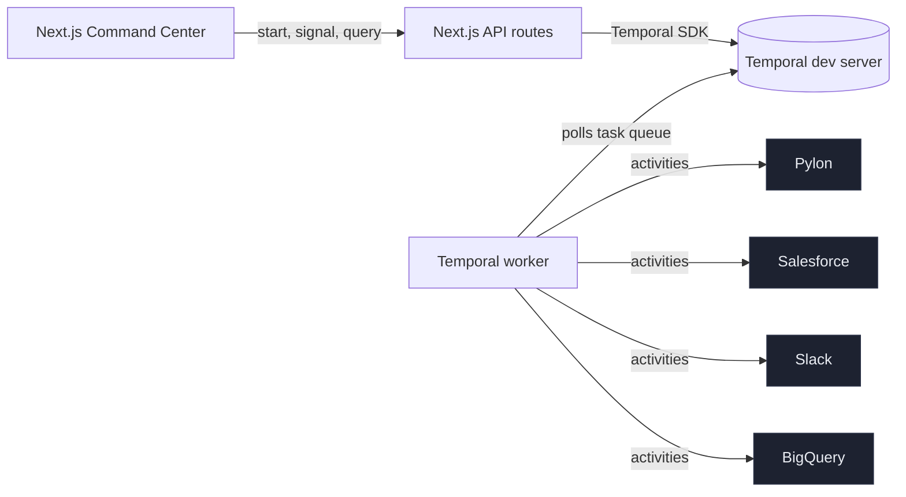

# Temporal Service Ops Command Center

A build-demo-as-application for Temporal's Support and Services Operations Manager role.

This prototype uses Temporal workflows to orchestrate support escalation across Pylon, Salesforce, Slack, and BigQuery, with durable retries, human-in-the-loop signals, workflow queries, and an audit trail visible in Temporal UI.

## Why Temporal matters here

Support escalations cross at least four tools — ticketing, CRM, chat, analytics. The dominant pattern today is Zapier-style automations that fail silently when one tool blips. Temporal makes the workflow durable: state persists across crashes, activities retry safely, signals from a CSM are first-class events, and every step is auditable in the Temporal UI. That's the difference between fragile automation and support operations infrastructure.

## Architecture



The workflow `SupportEscalationWorkflow` runs durably in the Temporal worker. The Next.js app is just a thin control plane: API routes start workflows, send signals, and query workflow state via the Temporal TypeScript SDK.

## Setup

Prerequisites:

- Node 20+ (project tested on Node 25)
- [Temporal CLI](https://docs.temporal.io/cli) installed locally

```bash
brew install temporal
```

Install and start:

```bash
npm install
cp .env.example .env

# Terminal 1 — Temporal dev server (UI on http://localhost:8233)
npm run temporal:server

# Terminal 2 — Temporal worker (task queue: support-ops-demo)
npm run temporal:worker

# Terminal 3 — Next.js UI on http://localhost:3000
npm run dev
```

## Environment variables

See `.env.example`. The build defaults to `USE_MOCKS=true` so Pylon, Salesforce, Slack, and BigQuery all work out of the box without credentials. If `SLACK_WEBHOOK_URL` is set, Slack messages will be POSTed for real; otherwise they're logged to the worker stdout and surfaced in the UI.

## Demo steps

1. Open http://localhost:3000.
2. Click **Seed Acme AI ticket** → starts `SupportEscalationWorkflow`.
3. Watch the Command Center poll the workflow query and walk through phases: `received → enriched → classified → case_created → notified → analytics_written → waiting_for_resolution`.
4. Click **Fail next BigQuery write** to arm the failure injection.
5. Click **Mark exec-visible**. The signal fires a Slack update and a BigQuery write — that write fails once, Temporal retries, the workflow keeps its state. The retry note appears in the case detail page.
6. Click **Bump priority → critical** to fire `changePriority`.
7. Click **Resolve case** to fire `resolveCase` and watch the workflow complete.
8. Open the Temporal UI link to see the full event history.

## API fallback

Every adapter (`src/adapters/*`) checks for credentials. If they're missing or `USE_MOCKS=true`, it returns realistic mock data so the demo never depends on external auth working. Real-API code paths are stubs you can fill in (Pylon REST, Salesforce REST, Slack webhook, BigQuery client) — the workflow contract is unchanged.

## Scripts

| Command | What it does |
| --- | --- |
| `npm run dev` | Start Next.js UI on :3000 |
| `npm run temporal:server` | Start Temporal dev server + UI on :8233 |
| `npm run temporal:worker` | Start the Temporal worker (registers `SupportEscalationWorkflow` + activities) |
| `npm run build` | Production Next.js build (used as a typecheck gate) |
| `npm test` | Vitest run for adapters + classification |

## Files of interest

- `src/temporal/workflows.ts` — the workflow with signals + query
- `src/temporal/activities.ts` — wraps adapters as Temporal activities
- `src/temporal/client.ts` — start, query, signal helpers used by API routes
- `src/temporal/worker.ts` — worker entrypoint
- `src/adapters/*.ts` — Pylon, Salesforce, Slack, BigQuery (real + mock)
- `src/components/CommandCenter.tsx` — main dashboard
- `src/components/CaseDetail.tsx` — per-workflow detail page
- `docs/demo-script.md` — 3-minute Loom script
- `docs/architecture.md` — short architecture doc
- `docs/outreach-blurb.md` — the email blurb that ships this demo

## Demo recording

> Loom: _add link here after recording._

## Outreach blurb

> _See `docs/outreach-blurb.md`._
